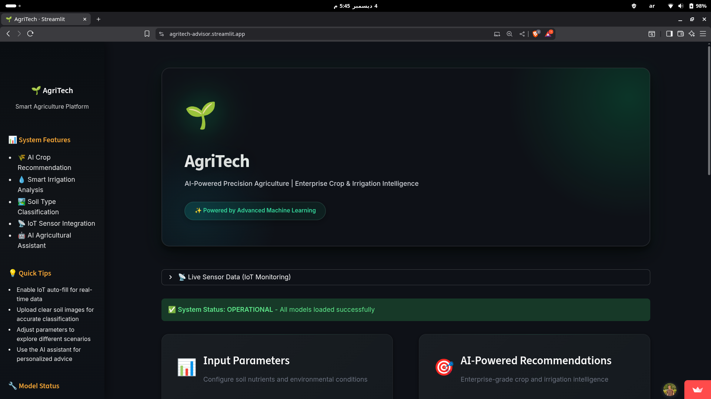
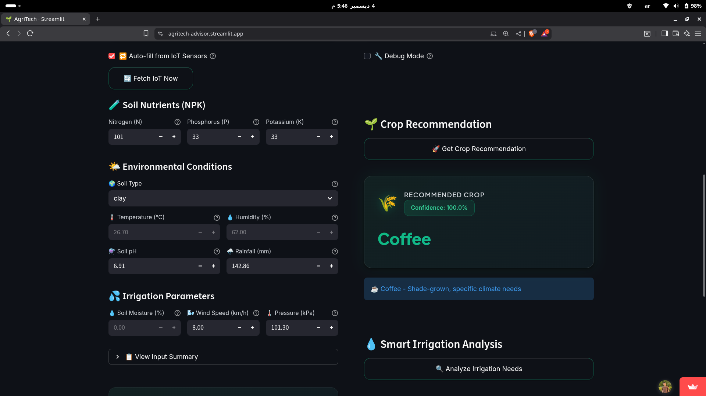
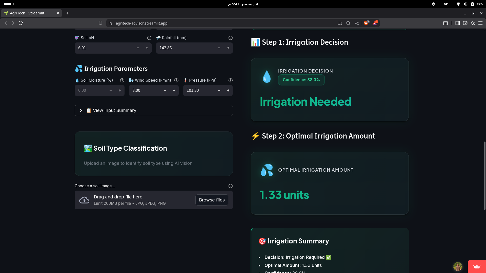
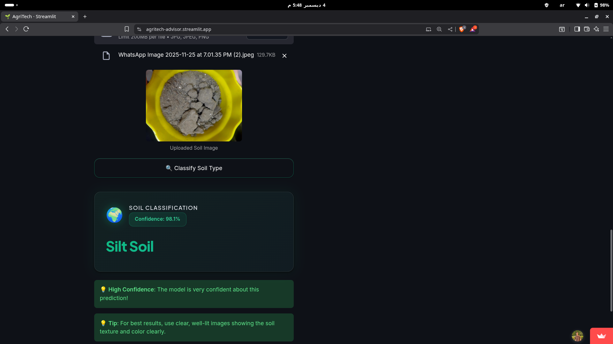
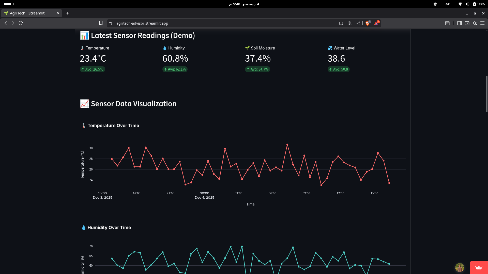
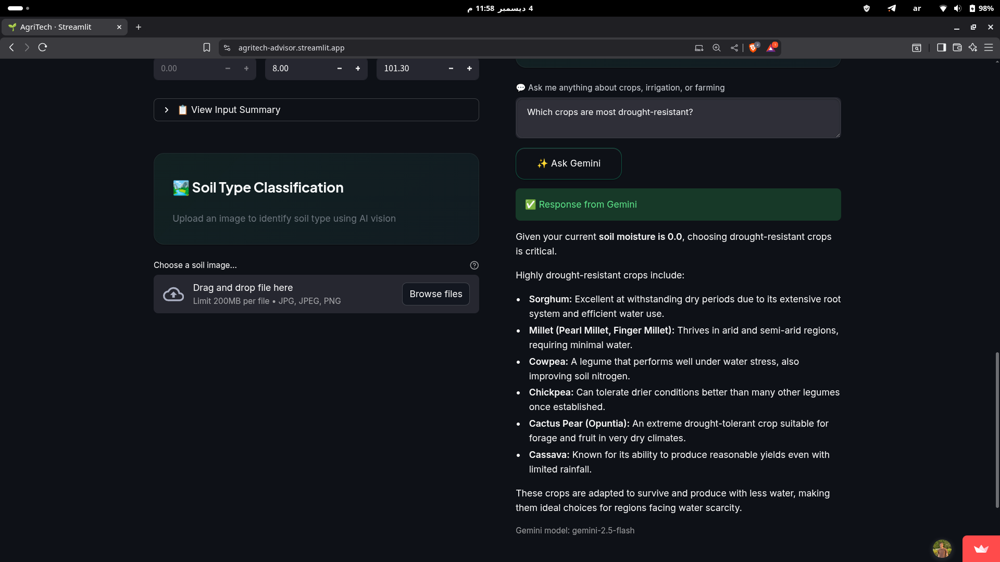
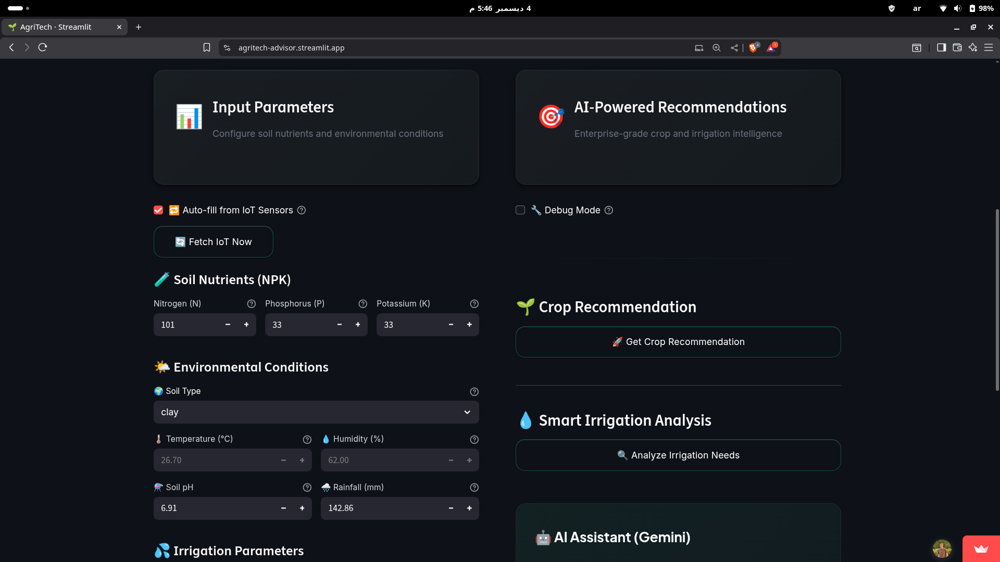

# 🌾 Intelligent Crop Irrigation Advisor

An AI-powered precision agriculture platform that provides crop recommendations and irrigation advice using advanced ML models with **full MLflow experiment tracking**.

## 🌐 Live Demo

**🚀 Try it now:** [https://agritech-advisor.streamlit.app/](https://agritech-advisor.streamlit.app/)

## 📸 Application Screenshots

### Main Interface
<div align="center">
  
  <p><em>Modern dark-themed dashboard with intuitive navigation and real-time system status</em></p>
</div>

### 🌱 Crop Recommendation System
<div align="center">
  
  <p><em>AI-powered crop recommendations</em></p>
</div>

### 💧 Smart Irrigation Analysis
<div align="center">
  
  <p><em>Two-step irrigation analysis: Decision making + Optimal amount calculation (1.33 units)</em></p>
</div>

### 🏞️ Soil Type Classification
<div align="center">
  
  <p><em>Deep learning-based soil classification</em></p>
</div>

### 📡 IoT Real-Time Monitoring
<div align="center">
  
  <p><em>Live sensor data visualization with temperature, humidity, soil moisture, and historical trends</em></p>
</div>

### 🤖 AI Agricultural Assistant (Gemini)
<div align="center">
  
  <p><em>Intelligent farming advice powered by Google Geminis</em></p>
</div>

### ⚙️ Input Parameters Interface
<div align="center">
  
  <p><em>Comprehensive parameter configuration: NPK nutrients, environmental conditions, and irrigation settings</em></p>
</div>

## 📊 Overview

- Crop recommendation with soil type feature (99.32% accuracy)
- Smart irrigation decision (CatBoost classifier with Optuna optimization)
- Irrigation amount optimization (CatBoost regressor)
- Soil type classification (CNN with TensorFlow)
- **MLflow experiment tracking and model management**
- IoT sensor integration (Supabase real-time data)
- Gemini AI agricultural assistant
- Modular feature-engineering pipeline and fail-safe mechanisms

## 🚀 Quick Start (Linux / macOS)

### 1. Setup Environment

```bash
# Create virtual environment
python -m venv venv
source venv/bin/activate

# Install requirements
pip install -r requirements.txt

# Or use the automated setup script
./mlflow_tools/setup_mlflow.sh
```

### 2. Train Models with MLflow Tracking

```bash
# Train all models with MLflow tracking
python mlflow_tools/train_all_models.py

# Or train a specific model
python mlflow_tools/train_all_models.py --model crop_recommendation
python mlflow_tools/train_all_models.py --model irrigation_optimization
python mlflow_tools/train_all_models.py --model smart_irrigation_classifier
```

### 3. View Results in MLflow UI

```bash
# Launch MLflow UI
python mlflow_tools/launch_mlflow.py

# Then open: http://localhost:5000
```

### 4. Run the Streamlit Application

```bash
# Launch the app locally
streamlit run streamlit_app/app.py --server.port 8501

# Or access the live deployment
# https://agritech-advisor.streamlit.app/
```

## 📊 MLflow Integration

### Features

- ✅ **Experiment Tracking**: All training runs are tracked with parameters and metrics
- ✅ **Model Registry**: Automatic model registration for deployment
- ✅ **Hyperparameter Optimization**: Optuna trials tracked in MLflow
- ✅ **Comparison Tools**: Compare model performance across experiments
- ✅ **Artifact Storage**: Model files, reports, and visualizations saved

### MLflow Commands

```bash
# Demo MLflow integration (quick test)
python mlflow_tools/demo_mlflow.py

# Train all models with tracking
python mlflow_tools/train_all_models.py

# Launch MLflow UI
python mlflow_tools/launch_mlflow.py

# Analyze and compare experiments
python mlflow_tools/mlflow_analysis.py --action all
```

### Experiments Created

1. **Crop-Recommendation-Model** - RandomForest classifier
2. **Irrigation-Optimization-Model** - CatBoost regressor  
3. **Smart-Irrigation-Classifier-Model** - CatBoost classifier with Optuna

## 📁 Project Structure

```
Intelligent-Crop-Irrigation-Advisor/
├── streamlit_app/                # Streamlit web application
│   └── app.py                    # Main application file
├── mlflow/                       # MLflow experiment tracking
│   ├── mlruns/                   # Tracking data (auto-created)
│   ├── train_all_models.py       # Train all models with tracking
│   ├── launch_mlflow.py          # MLflow UI launcher
│   ├── mlflow_analysis.py        # Experiment comparison tools
│   └── setup_mlflow.sh           # Automated setup script
├── models/                       # Trained ML models
│   ├── crop_recommendation/      # Crop model (99.32% accuracy)
│   ├── irrigation_optimization/  # Irrigation classifier & regressor
│   └── soil_classification/      # CNN soil type classifier
├── data/                         # Training datasets
│   ├── crop_data_with_soiltype.csv
│   ├── Final_irregation_optimization_data.csv
│   └── soil_images/              # Soil training images (54 samples)
├── docs/                         # Comprehensive documentation
│   ├── USER_GUIDE.md
│   ├── CROP_MODEL_DOCS.md
│   ├── SMART_IRRIGATION_CLASSIFIER.md
│   └── GEMINI_SERVICE_ACCOUNT_SETUP.md
├── hardware/                     # IoT integration code
│   └── IoTCode/                  # Arduino sensor code
└── requirements.txt              # Python dependencies
```

## 🔧 Windows Setup (PowerShell)

```powershell
# Create environment
python -m venv venv
.\venv\Scripts\Activate.ps1

# Install dependencies
pip install -r requirements.txt

# Train models
python train_all_models.py

# Launch MLflow UI
python launch_mlflow.py

# Run Streamlit app
python -m streamlit run frontend/streamlit_dashboard/app.py --server.port=8503
```

## 📚 Documentation

- **[MLFLOW_GUIDE.md](MLFLOW_GUIDE.md)** - Complete MLflow integration guide
- **[SETUP_MLFLOW.md](SETUP_MLFLOW.md)** - Installation instructions
- **[docs/](docs/)** - Model documentation and user guides

## 🧪 What Gets Tracked in MLflow

### All Models
- Model hyperparameters
- Dataset information (size, features)
- Performance metrics
- Feature importance scores
- Model artifacts (.pkl files)
- Training/test splits

### Crop Recommendation Model
- Accuracy, Precision, Recall, F1 Score
- Classification report
- Feature importance per feature

### Irrigation Optimization Model  
- MAE, RMSE, R², Adjusted R²
- Feature importance visualization
- CatBoost training metrics

### Smart Irrigation Classifier
- All 30 Optuna trials tracked
- Best hyperparameters
- Accuracy, Precision, Recall, F1 Score
- Classification report

## 🌟 Key Features

1. **Automated Training Pipeline** - Train all models with one command
2. **Experiment Tracking** - Compare model performance over time
3. **Model Registry** - Centralized model management
4. **Hyperparameter Optimization** - Optuna integration with MLflow
5. **Interactive UI** - MLflow dashboard for visualization
6. **Export Results** - Export metrics to CSV for analysis

## 📋 Requirements

- Python 3.11+
- Streamlit 1.50.0
- TensorFlow 2.18.0 (for soil classification CNN)
- CatBoost 1.2.8 (irrigation models)
- Scikit-learn 1.7.2 (crop recommendation)
- MLflow 2.9.0+ (experiment tracking)
- Optuna 3.5.0+ (hyperparameter tuning)
- Supabase (IoT sensor integration)
- Google Gemini API (AI assistant)

## 🔗 MLflow Workflow

```
Train Models → MLflow Tracks Everything → View in UI → Compare Results → Select Best Model → Deploy
```

## 🚀 Quick Demo

Test the MLflow integration without full training:

```bash
python mlflow_tools/demo_mlflow.py
python mlflow_tools/launch_mlflow.py
# Open http://localhost:5000
```

## 📝 Notes

- Models are tracked and versioned automatically
- MLflow data stored in `mlruns/` directory
- All experiments can be compared in the UI
- Best models are registered in Model Registry
- Git LFS used for large model artifacts

## 🤝 Contributing

When training new models, they will automatically be tracked in MLflow. Use the analysis tools to compare performance.

## 📄 License

See [LICENSE](LICENSE) file for details.

---

**Last updated**: 2025-11-18 (MLflow integration added)
   - 23 engineered features including NPK ratios, evapotranspiration, soil saturation
